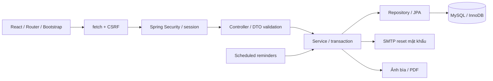
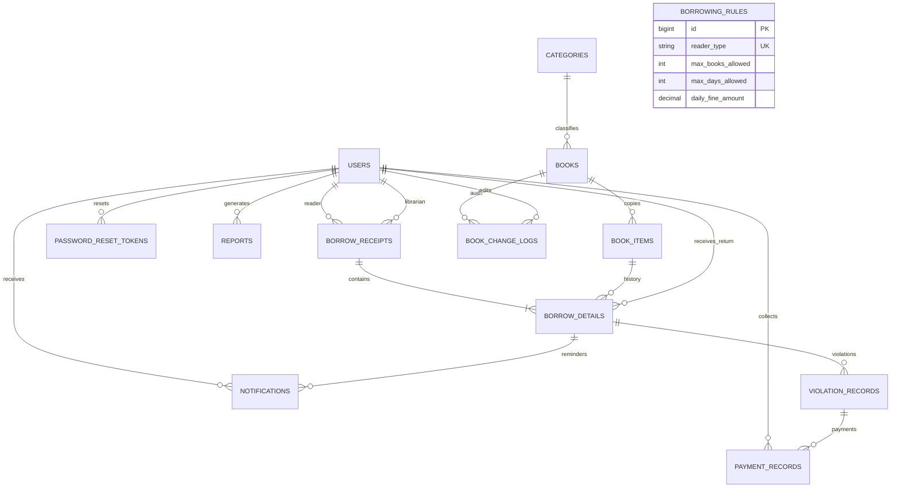

# Kiến trúc và quan hệ dữ liệu

Frontend độc lập; để ghép giao diện người khác, giữ DTO/endpoint, cookie, CSRF và quy ước thời gian/tiền trong API.md. Không cần viết lại backend vì thay giao diện.

User là entity trừu tượng. Admin/Librarian/Reader là entity riêng trong Java, lưu chung users theo SINGLE_TABLE. Role là discriminator, không có cột loại lớp con thứ hai để lệch dữ liệu. CHECK constraint bảo vệ trường tương ứng. Các quan hệ lịch sử dùng User thay vì lớp con có thể thay đổi; service xác nhận vai trò khi phát sinh giao dịch.

Các lớp kỹ thuật bổ sung:

| Thành phần | Mục đích |
| --- | --- |
| PaymentRecord | Tiền thực thu, thủ thư và key chống gửi lặp |
| PasswordResetToken | Hash SHA-256 token ngẫu nhiên 256-bit, hết hạn 30 phút, dùng một lần |
| BookChangeLog | Nhật ký giá trị trước/sau, người sửa, thời gian |
| closedAt/closureReason | Phân biệt trả vật lý và đóng nghĩa vụ mất sách |
| authVersion | Thu hồi quyền phiên cũ khi đổi role/status/password |

Mượn: khóa User Reader → kiểm tra hạn mức → Book theo ID → BookItem theo barcode → lưu phiếu/chi tiết và ON_LOAN. Return/lost: khóa Reader → receipt → item, refresh sau chờ khóa; receipt lock bảo vệ trạng thái tổng khi trả nhiều cuốn cùng lúc. Payment: khóa violation → kiểm tra key → tổng tiền đã thu → chặn vượt nợ → lưu. READ_COMMITTED tránh dùng snapshot cũ sau khi chờ khóa. Unique constraints là lớp bảo vệ cuối cùng.

| Chức năng | ADMIN | LIBRARIAN | READER |
| --- | --- | --- | --- |
| Danh mục, hồ sơ | Có | Có | Có |
| Sửa sách/cuốn/thể loại | Có | Có | Không |
| Tài khoản/phân quyền | Có | Không | Không |
| Tra cứu hồ sơ Reader | Qua quản lý tài khoản | Có | Không |
| Xem phiếu/vi phạm | Toàn bộ | Toàn bộ | Của mình |
| Giao sách/nhận trả/báo mất/thu phí | Không | Có | Không |
| Sửa quy định/báo cáo | Có | Không | Không |
| Thông báo | Của mình | Của mình | Của mình |

Giới hạn: ứng dụng một backend, session trong bộ nhớ, ảnh local; restart backend cần đăng nhập lại. Danh sách cuốn của đầu sách, quá hạn và lịch sử thu hiện trả toàn bộ; cần phân trang thêm nếu triển khai với lượng dữ liệu lớn. Không có module mua bán hoặc giữ chỗ.
